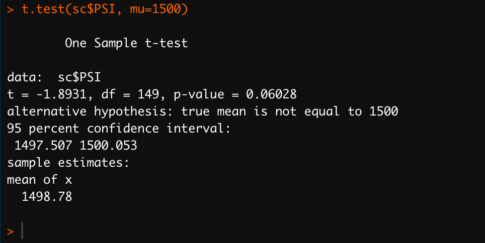

# MechaCar_Statistical_Analysis
Challenge 15

## Linear Regression to Predict MPG

### 1. Which variables/coefficients provided a non-random amount of variance to the mpg values in the dataset?

The varilables that provided a non-randmon amout of variance to the mpg are vehicle_length, ground_clearance and the intercept.

### 2. Is the slope of the linear model considered to be zero? Why or why not?

No. The p-value of our linear regression analysis is 5.35 x 10-11, which is much smaller than our assumed significance level of 0.05%. Therefore, we can state that there is sufficient evidence to reject our null hypothesis, which means that the slope of our linear model is not zero.

### 3. Does this linear model predict mpg of MechaCar prototypes effectively? Why or why not?

Yes, because it provides an r-squared of 0.7149 which is significantly higher than the r-squared value of 0.3715 obtained by performing a linear regression of mpg with vehicle_length only. The other variables when analyzed independently provide even lower r-squared values.

## Summary Statistics on Suspension Coils

When looking at the summary data for our MechaCar suspension coils it seems the variance of the suspension coils of 62.29 is not exceeding the limit of 100 per square inch.

But when looking at the summary data now grouped by Lot, we see the data for Lot3 indicating a variance of 170.27 pounds per square inch, which is much higher than the limit specific in the design. Lots 1 and 2 provide a variance of 0.98 and 7.47 respectively, which is within the design limit.

## T-Tests on Suspension Coils

### All Lots:
The results indicate that the true mean of the sample is 1498.78, which we also saw in the summary statistics above. The p-Value is 0.06, which is higher than the normal significance level of 0.05. This means there is NOT enough evidence to support rejecting the null hypothesis, so the mean of all three of these manufacturing lots is statistically similar to the presumed population mean of 1500.

### Lot 1: 
This sample has the mean of 1500, like shown in the summary statistics above and it's p-Value is equal to 1 (greater than 0.05). So in this lot the data do not give you any reason to conclude that the population mean differs from the designated value to which it has been compared. Thus, we CANNOT reject the null hypothesis.

### Lot 2:
This lot has the same outcome of Lot 1 with a sample mean of 1500.02 and a p-Value of 0.61 (greater than 0.05). Because of that we CANNOT reject the null hypothesis as well.

### Lot 3:
This sample has a different scenario from the other two. It's sample mean is 1496.14 and the p-Value is 0.04 (less than 0.05), so it is unlikely that the discrepancy observed between the sample mean and population mean is due to a coincidence. Therefore we have enough evidence to conclude that the population has a mean that is different from the sample value to which it has been compared. The difference is statistically significant, and the null hypothesis IS therefore rejected.

### Final Conclusion:
This can mean that something may be wrong in Lot 3 production cycle. It's best to recheck it's production cycle for system fails. Also we recommend that the suspension coils from this lot be removed from sales until they are checked and cleared out.

## Study Design: MechaCar vs Competition

In order to study several categories and be able to quantify how the MechaCar performs against the competition, we suggests that an ANOVA test be performed.

An ANOVA test is a statistical test used to determine if there is a statistically significant difference between two or more categorical groups by testing for differences of means using variance.

Another Key part of ANOVA is that it splits the independent variable into 2 or more groups. For example, one or more groups might be expected to influences the dependent variable while the other group is used as a control group, and is not expected to influence the dependent variable.

The categories thar should be tested are: 
- city and highway fuel efficiency
- maintenance cost
- safety rating

Using ANOVA test we can determine is Mecha Car are better than the it's competitors comparing the p-value from both samples: if the p-value is grater than 0.05, than Mecha Car performed better thant the competition; otherwise the competion performed better.
